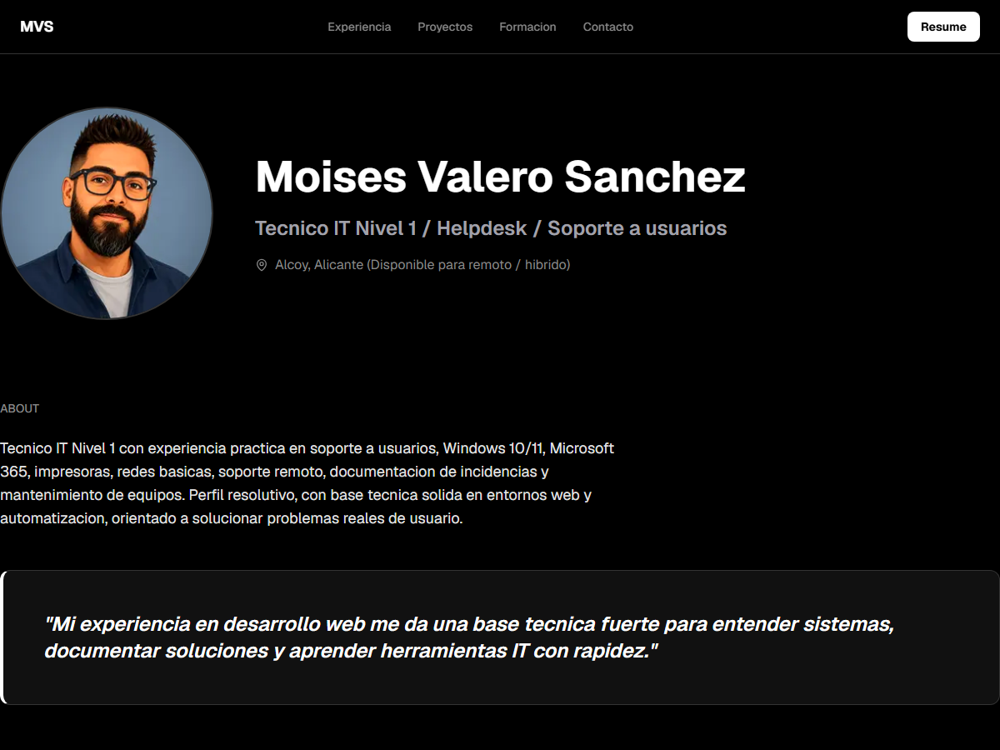

# Moisés Valero Sánchez - Portafolio Soporte IT

Micro landing profesional orientada a reclutadores para presentar mi perfil de **Técnico IT nivel 1 / Helpdesk / Soporte a usuarios**.



## Perfil

Soy Moisés Valero Sánchez, técnico IT con enfoque práctico en soporte a usuarios, resolución de incidencias y preparación de equipos. Trabajo con entornos Windows 10/11, Microsoft 365, Outlook, impresoras, redes básicas, soporte remoto y documentación de tickets.

Busco oportunidades en soporte IT, helpdesk o service desk, especialmente en entornos donde se valore la comunicación clara con usuarios, la autonomía y la capacidad de aprender herramientas internas con rapidez.

## Contenido del portafolio

- Resumen profesional enfocado a soporte IT nivel 1.
- Experiencia relevante en soporte informático, mantenimiento IT y control digital.
- Stack de herramientas: Windows, Microsoft 365, Outlook, Teams, AnyDesk, TeamViewer, GLPI/Jira, Freshdesk y Active Directory básico.
- Formación y certificaciones relacionadas con soporte, desarrollo web, IA aplicada y analítica.
- CV descargable en PDF desde la propia landing.

## Seguridad y privacidad

Este repositorio no incluye secretos, claves privadas ni variables de entorno reales.

Antes de hacerlo público se revisó:

- Ausencia de archivos `.env.local`, claves `.pem/.key` o credenciales privadas trackeadas.
- Búsqueda de patrones sensibles como tokens, passwords, claves API, IBAN y DNI/NIF.
- PDF público del CV revisado para evitar DNI/NIF, IBAN, números largos o dirección completa.

Los datos personales publicados quedan limitados al contenido profesional necesario del portafolio y del CV.

## Stack técnico

- Next.js 16
- React 19
- TypeScript
- Tailwind CSS 4
- pnpm
- oxlint
- knip
- Vitest
- Playwright
- Husky + lint-staged

## Desarrollo local

```bash
pnpm install
pnpm dev
```

La web queda disponible por defecto en:

```bash
http://localhost:3000
```

## Validación

```bash
pnpm lint
pnpm knip
pnpm check
pnpm format
pnpm test
pnpm test:e2e
pnpm build
```

## Estructura principal

```text
src/app/page.tsx                 Landing principal
src/app/globals.css              Sistema visual oscuro inspirado en Vercel
src/config/site.ts               Metadata base del portafolio
src/lib/seo.ts                   JSON-LD y metadata SEO
public/moises-valero-profile.png Imagen de perfil
public/moises-valero-cv-soporte-it.pdf CV descargable
tests/e2e/portfolio.spec.ts      Test responsive y enlace de descarga
```
